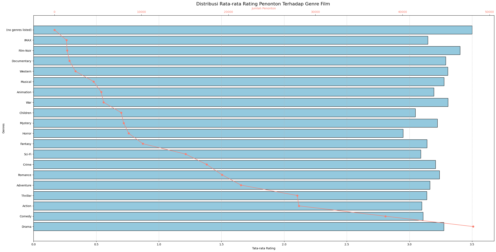

# Laporan Proyek Machine Learning - Nama Anda

## Project Overview

## Latar Belakang

Industri perfilman di seluruh dunia, termasuk di Indonesia, mengalami pertumbuhan pesat dalam beberapa tahun terakhir. Jumlah penonton bioskop terus meningkat, mencapai lebih dari 50 juta penonton hanya di Indonesia pada tahun 2018 dan produksi film baik dari luar maupun dalam negeri mencapai angka hampir 200 judul film yang telah tayang di seluruh Indonesia [[1]](https://indonesia.go.id/ragam/seni/sosial/tren-positif-film-indonesia). Sementara itu hingga Oktober 2018, IMDb memiliki kira-kira 5.3 juta film/acara (termasuk episode masing-masing) dan 9.3 tokoh di basis data tersebut. IMDb juga memiliki 83 juta pengguna terdaftar.Pertumbuhan ini menciptakan peluang besar namun juga menimbulkan tantangan baru, terutama bagi calon penonton [[2]](https://id.wikipedia.org/wiki/Internet_Movie_Database).

Kesulitan muncul ketika calon penonton dihadapkan pada banyaknya pilihan film. Proses mencari film yang sesuai dengan preferensi pribadi bisa menjadi tugas yang rumit dan memakan waktu. Menentukan film yang tepat sebelum menontonnya bukanlah jaminan kepuasan, karena preferensi seseorang terhadap film dapat berubah setelah menontonnya. Hal ini dapat menyebabkan pemborosan waktu dan biaya, terutama jika menonton film melalui bioskop, platform penyedia layanan streaming, atau pembelian dan penyewaan kaset DVD.

Mengatasi kesulitan ini, beberapa situs web dan aplikasi telah muncul, seperti [suggestmemovie.com](https://www.suggestmemovie.com/) yang memberikan saran film kepada pengguna berdasarkan preferensi atau suasana hati. Namun, pengunjung situs sering kali harus mencoba beberapa kali sebelum menemukan film yang dianggap "bagus".

Mengingat kompleksitas pilihan film dan keinginan penonton untuk pengalaman yang lebih efisien, perlu dikembangkan solusi yang dapat memberikan rekomendasi film yang relevan berdasarkan karakteristik dan preferensi penonton. Analisis mendalam terhadap data distribusi genre, rating film, dan performa film terbaik menjadi kunci dalam memahami dinamika industri ini. Dalam konteks ini, implementasi sistem rekomendasi, baik berbasis konten maupun kolaboratif, dapat menjadi langkah positif untuk meningkatkan pengalaman penonton dalam menemukan dan menikmati film yang sesuai dengan selera penonton. Dengan demikian, proyek ini bertujuan untuk mengatasi tantangan ini dan memberikan solusi yang efisien untuk menyederhanakan proses pemilihan film bagi penonton.

## Business Understanding

Berdasarkan latar belakang yang sudah dipaparkan sebelumnya, berikut rincian masalah yang dapat diselesaikan dalam proyek ini :

### Problem Statements

Menjelaskan pernyataan masalah latar belakang:
+ Bagaimana memahami karakteristik dan distribusi data pada dataset film dan penilaian penonton?
+ Bagaimana meningkatkan pengalaman penonton dalam menemukan film yang sesuai dengan minat penonton?
+ Bagaimana memberikan rekomendasi film yang relevan berdasarkan preferensi penonton?

### Goals

Menjelaskan tujuan dari pernyataan masalah:
+ Menampilkan chart untuk distribusi genre film untuk menyoroti genre film yang paling populer, distribusi rating serta menampilkan film terbaik dan terpopular berdasarkan rating penonton.
+ Membuat sistem rekomendasi film yang dapat memberikan rekomendasi film berdasarkan selera penonton.
+ Memanfaatkan data rating film dari penonton untuk memberikan rekomendasi film berdasarkan perilaku penonton.

### Solution statements
1. Visualisasi Karakteristik Data:

   + Mengumpulkan data distribusi genre film dari dataset.
   + Melakukan analisis statistik untuk menentukan distribusi rating penonton.
   + Menentukan kriteria untuk film terbaik berdasarkan rating penonton.
   + Menentukan kriteria untuk film terpopuler berdasarkan jumlah penonton.
   + Menggunakan teknik visualisasi data untuk mempresentasikan distribusi genre film, rating, serta menampilkan film terbaik dan terpopuler secara jelas dan intuitif.

2. Menggunakan pendekatan Content-based Filtering untuk memberikan rekomendasi film berdasarkan selera penonton (genre).
    + Menggunakan pendekatan TF-IDF untuk mengonversi `genres` menjadi representasi numerik.
    + Mengubah matrix menjadi dense meggunakan pendekatan `todense()` 
    + Menghitung  derajat kesamaan kosinus antar film berdasarkan representasi numerik.
    + Memberikan rekomendasi film berdasarkan kesamaan genre.

3. Menggunakan pendekatan Collaborative Filtering untuk memberikan rekomendasi film berdasarkan perilaku penonton.
    + Melakukan _encoding_ pada atribut `userId` dan `movieId`.
    + Membangun model _RecommenderNet_ menggunakan TensorFlow dan Keras.
    + Melakukan pembagian data untuk data _training_ dan data _validation_
    + Melakukan _training_ model dengan data _training_.
    + Memberikan rekomendasi film yang personal untuk penonton berdasarkan perilaku penonton.

## Data Understanding
_Dataset_ yang digunakan dalam proyek ini adalah [_Movielens dataset_](https://www.kaggle.com/datasets/ayushimishra2809/movielens-dataset/data) yang diambil dari platform kaggle.com yang dipublikasikan oleh AYUSHI MISHRA. Dataset ini memberikan informasi terperinci terkait faktor-faktor umum yang memengaruhi kecelakaan di jalan raya, seperti tingkat keparahan tabrakan, kondisi cuaca, jenis jalan, dan elemen-elemen yang berkontribusi, sehingga memberikan wawasan berharga untuk analisis dan peningkatan langkah-langkah keselamatan jalan raya secara keseluruhan, dengan atribut dataframe dapat dilihat pada Tabel 1 dan Tabel 2.

Tabel 1. Atribut pada data _movies.csv_ 
Atribut  | Keterangan | Tipe Data |
-------- | ------------- | -------------- |
_movieId_ | merepresentasikan Id unik untuk setiap film | _int64_ |
_title_ | merepresentasikan judul untuk setiap film | _object_ |
_genres_ | merepresentasikan genre untuk setiap film | _object_ |

Pada data _movies.csv_ berisikan informasi sebanyak 10329 baris dan 3 kolom data dengan 2 data duplikat pada kolom _title_ dan tidak ada nilai yang hilang. 

Dalam kumpulan data ini, terdapat 105,339 rating yang telah diberikan kepada 10,329 film yang beragam. Peringkat rata-rata yang tercatat adalah sebesar 3,5, dengan rentang peringkat minimum dan maksimum masing-masing adalah 0,5 dan 5. Hal ini mencerminkan variasi luas dalam preferensi penonton terhadap film. Menariknya, sebanyak 668 penonton berkontribusi dalam memberikan rating untuk 149,532 film, menunjukkan partisipasi yang substansial dan kompleksitas dalam dataset ini.

Tabel 2. Atribut pada data _ratings.csv_
Attribute  | Keterangan
------------- | -------------
userId | merepresentasikan Id unik untuk setiap penonton
movieId | merepresentasikan Id unik untuk setiap film     
rating | merepresentasikan penilaian yang diberikan oleh penonton
timestamp | merepresentasikan waktu ketika penilaian diberikan

Pada data _ratings.csv_ berisikan informasi sebanyak 105339 baris dan 4 kolom data.

Dalam kumpulan data ini, secara singkat terdapat 105,339 rating yang diberikan penonton terhadap 10,329 film dengan rata-rata rating adalah 3,5 dengan rentang minimum dan maksimum masing-masing adalah 0,5 dan 5. Hal ini mencerminkan variasi luas dalam preferensi penonton terhadap film. Menariknya, sebanyak 668 penonton berkontribusi dalam memberikan rating untuk 149,532 film, menunjukkan partisipasi yang substansial dan kompleksitas dalam dataset ini.

### Visualisasi Data
1. Distribusi Genre Film:
   - Analisis data _genre film_ menunjukkan variasi yang menarik dalam preferensi penonton. _Genre Drama_ memimpin dengan jumlah film terbanyak (1385), diikuti oleh _Comedy_ dengan 826 film. Kombinasi _Comedy|Drama_ dan _Drama|Romance_ juga cukup umum, masing-masing dengan 465 dan 421 film. Ini menandakan bahwa film-film dengan campuran elemen dramatis, komedi, dan unsur romantis mendapat perhatian yang signifikan. Di sisi lain, film-film dengan kombinasi _Action|Adventure|Children|Comedy|Mystery_ atau _Adventure|Drama|Romance|Thriller|War_ hanya muncul satu kali. Meskipun jarang, keberagaman ini mencerminkan bahwa ada eksperimen dan inovasi dalam menciptakan film dengan gabungan genre yang lebih kompleks dan bervariasi Penting untuk mencatat bahwa film dengan genre yang jarang mungkin memiliki audiens yang lebih terbatas, namun dapat memberikan pengalaman yang unik dan menarik bagi penonton yang menyukai kombinasi genre tersebut seperti yang ditunjukkan pada Gambar 1.
  
  Gambar 1. Distribusi persebaran _genre_ film
   - Meskipun _Drama_ dan _Comedy_ mendominasi jumlah film, _genre Film-Noir_ menonjol dengan rating rata-rata tertinggi, mencapai 3.40, meskipun dengan jumlah penonton yang relatif kecil. Hal ini mengindikasikan bahwa film-film dalam _genre Film-Noir_ mungkin kurang umum tetapi mendapatkan penilaian positif. Sementara itu, _genre War_ dan _Western_ memiliki rating yang kompetitif meskipun jumlah filmnya lebih sedikit, menandakan daya tarik khusus di antara penonton. Terdapat perbedaan signifikan dalam rating _genre Horror_ yang lebih rendah (2.95), meskipun jumlah penonton yang cukup tinggi, menunjukkan bahwa genre ini mungkin memiliki tingkat kepuasan yang lebih rendah di antara penonton. _Documentary_ dan _Musical_, meskipun tidak mendominasi jumlah film, menonjol dengan rating rata-rata yang solid dan partisipasi penonton yang tinggi, menandakan adanya pasar setia. _Genre Adventure_ dan _Sci-Fi_ menarik perhatian dengan rating yang tinggi dan partisipasi penonton yang signifikan, menunjukkan bahwa film-film dalam _genre Adventure_ dan _Sci-Fi_ berhasil menyatukan elemen yang menarik bagi penonton. _Genre IMAX_ dengan rating 3.15 dan partisipasi penonton yang relatif rendah menunjukkan bahwa film-film IMAX memberikan pengalaman khusus yang dihargai oleh penonton yang menonton seperti yang ditunjukkan pada Gambar 2.
   
   Gambar 2. Distribusi rata-rata rating penonton terhadap _genre_ film

2. Distribusi Rating Film:
   - Dari Gambar 3, terlihat bahwa mayoritas penilaian film cenderung tinggi, dengan lebih dari setengah total rating berada pada rentang 4.0 hingga 5.0. Ini menunjukkan bahwa film-film dalam dataset ini cenderung mendapat penerimaan positif dan memberikan pengalaman yang memuaskan bagi penonton. Lebih dari 60% dari total rating terkonsentrasi pada level 4.0 dan 5.0, menandakan bahwa banyak penonton memberikan penilaian yang sangat baik. Meskipun terdapat dominasi rating tinggi, distribusi rating secara keseluruhan terlihat merata di seluruh spektrum, mencerminkan keberagaman selera penonton dalam dataset ini. Pada sisi lain, terdapat sejumlah rating di bawah 2.5, menandakan adanya film-film yang mungkin tidak mendapat sambutan baik atau bahkan menerima kritikan negatif dari penonton.
   
   Gambar 3. Distribusi persebaran _genre_ film

3. Film Terbaik Berdasarkan Akumulasi Rating:
   - Dari gambar 4 terlihat bahwa film "Shawshank Redemption" (1994) mencuat sebagai pemenang dengan rating tertinggi (1372.0) dan jumlah penonton yang memberikan rating yang mengesankan (308). Ini menandakan bahwa film ini bukan hanya dihargai secara kualitatif, tetapi juga berhasil menarik perhatian sejumlah besar penonton. Sementara itu, "Pulp Fiction" (1994) menonjol sebagai film dengan rating tinggi (1352.0) dan partisipasi penonton yang substansial (325), menandakan daya tarik luas dan penerimaan yang positif di kalangan penonton. "Forrest Gump" (1994) juga berhasil, memperoleh rating yang tinggi (1287.0) dengan partisipasi penonton yang mencukupi (311), menciptakan pengalaman berkesan untuk penonton. Film-film klasik seperti "Silence of the Lambs" (1991) dan "Star Wars: Episode IV - A New Hope" (1977) tetap relevan dengan rating yang tinggi dan perhatian dari penonton. Kesuksesan berkelanjutan juga terlihat pada "Matrix" (1999) dan "Jurassic Park" (1993), menunjukkan daya tarik abadi dari karya-karya tersebut. Film "Terminator 2: Judgment Day" (1991) memperlihatkan pengaruh genre aksi dengan rating yang solid (1002.0) dan partisipasi penonton yang baik (253). 
   
  Gambar 4. Distribusi persebaran _genre_ film

4. Film Terpopuler Berdasarkan Rating dan Jumlah penonton:
   - Dapat dilihat pada Gambar 5, tercatat bahwa "Shawshank Redemption" (1994) mendominasi dengan rata-rata rating tertinggi, mencapai 4.45, meskipun jumlah penonton tidak sebanyak film lain dalam daftar. Keberhasilan film ini menunjukkan bahwa kualitas yang tinggi dapat membantu menciptakan reputasi yang kuat. "Pulp Fiction" (1994) tetap menjadi salah satu film paling populer, dengan rata-rata rating 4.16 dan partisipasi penonton yang tinggi sebanyak 325. Film ini mencerminkan daya tarik yang berkelanjutan dan penghargaan yang terus menerus dari penonton. "Silence of the Lambs" (1991) juga mempertahankan rating tinggi (4.19) dan menunjukkan konsistensi dalam penerimaan penonton. Bahkan film klasik seperti "Star Wars: Episode IV - A New Hope" (1977) tetap relevan dengan rating 4.19, mencerminkan pengaruh abadi yang dimiliki film klasik dalam industri film. "Matrix" (1999) terus memukau penonton dengan rata-rata rating 4.26 dan partisipasi penonton yang kuat (261), menunjukkan daya tarik genre ilmiah-fiksi. Meskipun tidak mencapai rata-rata rating tertinggi, "Terminator 2: Judgment Day" (1991) tetap berhasil dengan rating 3.96 dan partisipasi penonton yang baik (253). "Schindler's List" (1993) dengan rating 4.30 menunjukkan bahwa karya dengan tema berat dapat meraih sukses mendalam dan mendapat apresiasi tinggi dari penonton.
   
  Gambar 5. Distribusi persebaran _genre_ film

## Data Preparation

Pada tahap awal persiapan data, dilakukan penanganan terhadap duplikasi data pada dataset film (_Movies Dataset_). Penggunaan fungsi `duplicated()` dijustifikasi karena dapat dengan mudah mengidentifikasi duplikasi pada kolom _title_, yang penting untuk memastikan keberlanjutan integritas dataset. Fungsi ini memberikan informasi yang diperlukan untuk melihat baris mana yang merupakan duplikat, sehingga dapat diambil tindakan selanjutnya. Selanjutnya, penggunaan `drop()` untuk menghapus baris dengan data ganda merupakan pilihan tepat untuk menjaga kebersihan dataset.

Selanjutnya, fokus diberikan pada penanganan nilai yang hilang pada dataset film. Pemilihan fungsi `isnull()` untuk mengidentifikasi jumlah nilai yang hilang pada setiap atribut didasarkan pada kebutuhan untuk mengetahui apakah ada kebutuhan untuk imputasi nilai atau penanganan khusus. Dalam konteks ini, dataset film tidak mengandung nilai yang hilang, dan ini memastikan keberlanjutan dan keutuhan data tanpa adanya pengaruh dari nilai yang hilang.

Proses berlanjut pada dataset _rating_ (_Ratings Dataset_), di mana terlebih dahulu dilakukan pengecekan terhadap duplikasi data dengan fungsi `duplicated()`. Pemilihan fungsi ini disesuaikan dengan kebutuhan untuk mengidentifikasi data yang mungkin identik, sehingga hasil analisis dapat dapat diandalkan. Dalam kasus ini, tidak adanya duplikasi memvalidasi integritas dataset.

Selanjutnya, penanganan nilai yang hilang pada dataset _rating_ dilakukan menggunakan fungsi `isnull()`. Penggunaan fungsi ini disesuaikan dengan kebutuhan untuk melihat apakah dataset mengandung nilai yang hilang. Dalam konteks ini, dataset _rating_ juga tidak mengandung nilai yang hilang, mengindikasikan kualitas dan konsistensi data yang baik.

Terakhir, untuk menyederhanakan struktur dataset _rating_, atribut 'timestamp' dihapus dengan menggunakan fungsi `drop()`. Pemilihan fungsi ini dilakukan untuk memudahkan pemrosesan data tanpa mempengaruhi hasil analisis, karena informasi waktu ketika suatu _rating_ diberikan mungkin tidak relevan. Oleh karena itu, untuk menyederhanakan struktur dataset dan memfokuskan analisis pada informasi yang lebih esensial, kolom 'timestamp' dihapus.

## Modeling & Result

Content-Based Filtering, dengan fokus pada karakteristik item, mengandalkan kualitas fitur untuk memberikan rekomendasi yang personal. Keunggulan terletak pada efektivitasnya pada data pengguna yang terbatas dan kemampuannya menangani Cold Start Problem. Namun, rentan terhadap "filter bubble" dan ketergantungan pada kualitas fitur yang digunakan.

Sementara itu, Collaborative Filtering, baik user-based maupun item-based, mengeksplorasi pola interaksi pengguna dan item. Meskipun efektif menangani Cold Start Problem dan menemukan pola kompleks, model ini dapat terpengaruh oleh data yang sparse dan kesulitan menangani perubahan preferensi seiring waktu.
### Pengembangan Model dengan Content Based Filtering

1. TF-IDF Vectorizer
  
    Pada tahap ini, digunakan TF-IDF Vectorizer untuk mengekstrak fitur dari kolom `genres` pada dataset film. Fungsi TfidfVectorizer() digunakan untuk mengonversi teks menjadi matriks TF-IDF, yang kemudian digunakan untuk mengukur sejauh mana suatu kata kunci (term) signifikan dalam suatu dokumen. Dalam hal ini, dokumen adalah deskripsi genre film. Representasi vektor ini dihitung menggunakan formula _TF-IDF_:

    Term Frequency (TF) adalah frekuensi suatu kata dalam dokumen. Rumusnya adalah:

    $$TF(t, d) = \frac{f_{t, d}}{\sum_{t' \in d} f_{t', d}}$$

    di mana:
    - $f_{t, d}$ adalah frekuensi kata $t$ dalam dokumen $d$
    - $\sum_{t' \in d} f_{t', d}$ adalah jumlah semua kata dalam dokumen $d$
    
    Inverse Document Frequency (IDF) adalah ukuran seberapa jarang suatu kata muncul di seluruh dokumen. Rumusnya adalah:

    $$IDF(t, D) = \log \frac{N}{|{d \in D : t \in d}|}$$

    di mana:
    - $N$ adalah jumlah total dokumen
    - $|{d \in D : t \in d}|$ adalah jumlah dokumen yang mengandung kata $t$
    
    TF-IDF kemudian dihitung dengan mengalikan TF dan IDF:

    $$TFIDF(t, d, D) = TF(t, d) \times IDF(t, D)$$
   

3.  Mengubah Matriks menjadi Dense

    Setelah mendapatkan matriks _TF-IDF_, kemudian mengubah matriks tersebut menjadi format _dense_ agar dapat diinterpretasikan dengan mudah. Proses ini dilakukan dengan menggunakan fungsi `todense()`.

4. Menghitung Derajat Kesamaan (Cosine Similarity)
    
    Langkah selanjutnya adalah menghitung derajat kesamaan antara film menggunakan metode _Cosine Similarity_.
    $$\text{Cosine Similarity}(A, B) = \frac{A \cdot B}{||A|| ||B||} = \frac{\sum_{i=1}^{n} A_i B_i}{\sqrt{\sum_{i=1}^{n} A_i^2} \sqrt{\sum_{i=1}^{n} B_i^2}}$$
    di mana:
    - $A . B$ adalah jumlah total dokumen
    - $||A||$ dan $||B||$ adalah jumlah dokumen yang mengandung kata $t$

5. Hasil

    | No. | Judul Film | Genre |
    | --- | --- | --- |
    | 1 | _"Confessions of a Dangerous Mind (2002)"_ | _Comedy\|Crime\|Drama\|Thriller_ |
    | 2 | _"Informant!, The (2009)"_ | _Comedy\|Crime\|Drama\|Thriller_ |
    | 3 | _"Cul-de-sac (1966)"_ | _Comedy\|Crime\|Drama\|Thriller_ |
    | 4 | _"Hard Word, The (2002)"_ | _Comedy\|Crime\|Drama\|Thriller_ |
    | 5 | _"Fargo (1996)"_ | _Comedy\|Crime\|Drama\|Thriller_ |

    Dari hasil rekomendasi di atas, semua film yang direkomendasikan memiliki genre yang sama yaitu Comedy|Crime|Drama|Thriller. 

### Pengembangan Model dengan Collaborative Filtering

1. Encoding Atribut userId dan movieId

    Pada tahap ini, dilakukan encoding untuk atribut `userId` dan `movieId` pada dataset _rating_ (_Ratings Dataset_). Encoding ini dilakukan untuk mengubah nilai unik dari kedua atribut tersebut menjadi nilai numerik degan tujuan untuk meningkatkan efisiensi, mengurangi dimensi, memberikan identitas unik, dan meningkatkan kinerja model sistem rekomendasi.

2. Membagi Data untuk Pelatihan dan Validasi

    Dataset peringkat dibagi menjadi dua bagian, yaitu data pelatihan dan data validasi, menggunakan fungsi `train_test_split()` dari `scikit-learn`. Tujuan utama dari membagi dataset peringkat menjadi data _rating_ dan data validasi adalah untuk mempersiapkan data agar dapat digunakan dalam proses pelatihan dan evaluasi model.

3. Proses Pelatihan

    Proses pelatihan model _Collaborative Filtering_ menggunakan kelas `RecommenderNet` bertujuan untuk mengembangkan sistem rekomendasi film yang dapat memberikan saran yang akurat berdasarkan pola peringkat dalam dataset. Dalam tahap inisialisasi, konstruktor kelas mempersiapkan model dengan membuat _embedding layers_ untuk pengguna dan film, serta _bias layers_ yang diterapkan untuk menghasilkan representasi numerik dari entitas tersebut. Penggunaan _he_normal_ sebagai metode inisialisasi memastikan parameter model memiliki bobot yang sesuai selama proses pelatihan.
    
    Selanjutnya, proses _forward pass_ pada model dilakukan dalam fungsi `call`. Pada tahap ini, vektor pengguna dan film diambil dari _embedding layers_, dan perhitungan dot product antara keduanya dilakukan. _Bias layers_ kemudian ditambahkan pada hasil perhitungan, dan fungsi aktivasi sigmoid diterapkan untuk menghasilkan nilai antara 0 dan 1, sesuai dengan sifat tugas peringkat film.
    
    Proses pelatihan ini juga menerapkan teknik regularisasi dengan _L2 regularization_ pada _embedding layers_ untuk menghindari _overfitting_ dan memastikan bahwa model mampu generalisasi dengan baik pada data yang belum pernah dilihat sebelumnya.
    
    Setelah model diinisialisasi dan strukturnya ditentukan, langkah selanjutnya adalah melakukan kompilasi menggunakan fungsi `compile`. _Loss function_ yang dipilih adalah _Binary Crossentropy_, sesuai dengan sifat tugas peringkat, dan _Adam optimizer_ digunakan untuk mengoptimalkan parameter model dengan tingkat pembelajaran 0.001. 

4. Mengambil rekomendasi film

    Terakhir, untuk mendapatkan rekomendasi film, dilakukan langkah-langkah berikut:
    1. Memilih satu pengguna secara acak.
    2. Menyaring film yang telah ditonton oleh pengguna tersebut.
    3. Mengidentifikasi film yang belum ditonton oleh pengguna.
    4. Menggunakan model Collaborative Filtering untuk membuat prediksi rating untuk film yang belum ditonton.
    5. Menyajikan rekomendasi berdasarkan prediksi rating tertinggi.

5. Hasil
    Rekomendasi film berdasarkan preferensi penonton 331
    
    Film dengan rekomendasi tertinggi dari penonton
    
    | Judul Film | Genre |
    | --- | --- |
    | Star Wars: Episode IV - A New Hope (1977) | Action\|Adventure\|Sci-Fi |
    | Parent Trap, The (1961) | Children\|Comedy\|Romance |
    | Pollyanna (1960) | Children\|Comedy\|Drama |
    | Parent Trap, The (1998) | Children\|Comedy\|Romance |
    | Harry Potter and the Prisoner of Azkaban (2004) | Adventure\|Fantasy\|IMAX |

    10 Rekomendasi Film Teratas 

    | Judul Film | Genre |
    | --- | --- |
    | Schizopolis (1996) | Comedy |
    | Fireworks (Hana-bi) (1997) | Crime\|Drama |
    | Wings (1927) | Action\|Drama\|Romance\|War |
    | Bandit Queen (1994) | Drama |
    | Antwone Fisher (2002) | Drama |
    | Interstate 60 (2002) | Adventure\|Comedy\|Drama\|Fantasy\|Mystery\|Sci-Fi\|Thriller |
    | Nobody Knows (Dare mo shiranai) (2004) | Drama |
    | Gentlemen of Fortune (Dzhentlmeny udachi) (1972) | Comedy\|Crime\|Drama\|Mystery |
    | Resident Evil: Retribution (2012) | Action\|Horror\|Sci-Fi\|IMAX |
    | Louis C.K.: Live at The Comedy Store (2015) | Comedy |

## Evaluation

### Evaluasi Content-Based Filtering Model

Pada pendekatan Content-Based Filtering, evaluasi dilakukan secara manual menggunakan metrik Precision (Presisi) yang dikhususkan untuk model sistem rekomendasi. Dalam sistem rekomendasi, precision mengukur jumlah item rekomendasi yang relevan dibandingkan dengan total item yang direkomendasikan.

Dalam kasus ini, pengguna telah menonton film _Pulp Fiction (1994)_ dengan genre _Comedy|Crime|Drama|Thriller_. Oleh karena itu, sistem merekomendasikan film-film dengan genre yang sama. Berikut adalah hasil rekomendasi dari sistem untuk film _Pulp Fiction (1994)_:

Dari hasil rekomendasi di atas, semua film yang direkomendasikan memiliki genre yang sama yaitu Comedy|Crime|Drama|Thriller. Dengan demikian, jika mengacu pada formula precision, dapat dihitung sebagai berikut:

$$Precision = \frac{\text{Jumlah film yang relevan dari rekomendasi model}}{\text{Jumlah total film yang direkomendasikan}}$$

$Precision = \frac{5}{5} = 1$

Skor precision sistem rekomendasi untuk film _Pulp Fiction (1994)_ adalah sebesar 1 atau 100%. Hal ini menunjukkan bahwa semua film yang direkomendasikan memiliki genre yang relevan dengan film yang telah ditonton oleh pengguna, menunjukkan kualitas rekomendasi yang baik berdasarkan genre film.

### Evaluasi Collaborative Filtering Model

Metrik evaluasi yang digunakan adalah _Root Mean Squared Error_ (RMSE). Tujuan utama dari proses pelatihan model _Collaborative Filtering_ adalah untuk mengajarkan model untuk memahami pola dan hubungan antara pengguna (`userId`), item (`movieId`), dan _rating_ (`rating`) pada dataset pelatihan.  Tujuan menggunakan _RMSE_ adalah untuk mengukur sejauh mana nilai yang diprediksi oleh model berbeda dari nilai yang sebenarnya. _RMSE_ memberikan ukuran absolut dari jarak rata-rata bahwa titik data jatuh dari nilai yang diprediksi menggunakan unit dari variabel dependen1. Nilai _RMSE_ yang rendah menunjukkan bahwa model cocok dengan data dengan baik dan memiliki prediksi yang lebih akurat.

$$RMSE = \sqrt{\frac^{n}{\sum_{i=1}(P_i - O_i)^2}{n}}$$
di mana:
  - $Pi$ adalah nilai yang diprediksi untuk pengamatan ke-i.
  - $Oi$ adalah nilai aktual dari pengamatan ke-i.
  - $n$ adalah jumlah pengamatan.

Berikut ini merupakan hasil dari metrics evaluasi yang dapat dilihat pada Gambar 6.

 Gambar 6. Distribusi metrics evaluasi

### Perbandingan peforma model
Jika fokus utama adalah personalisasi berdasarkan konten (seperti genre film), Content-Based Filtering mungkin memberikan hasil yang lebih baik, seperti yang terlihat pada nilai precision yang tinggi. Di sisi lain, Collaborative Filtering, dengan nilai RMSE yang rendah, menunjukkan kemampuan model dalam memahami pola interaksi pengguna dan item, serta memberikan prediksi peringkat yang akurat.

## Kesimpulan
1. Karakteristik dan distribusi data
   + Distribusi Genre Film: Analisis genre film menunjukkan bahwa _Drama_ adalah genre terbanyak dengan 1385 film, diikuti oleh _Comedy_ dengan 826 film. Genre campuran seperti _Comedy|Drama_ dan _Drama|Romance_ juga cukup umum. Genre yang jarang muncul seperti _Action|Adventure|Children|Comedy|Mystery_ atau _Adventure|Drama|Romance|Thriller|War_ menunjukkan eksperimen dan inovasi. Meskipun _Drama_ dan _Comedy_ mendominasi jumlah film, _Film-Noir_ menonjol dengan rating tertinggi (3.40), sementara _Horror_ memiliki rating lebih rendah (2.95). _Documentary_ dan _Musical_ mencapai rating solid dan partisipasi penonton tinggi. _Adventure_ dan _Sci-Fi_ menarik perhatian dengan rating tinggi dan partisipasi penonton yang signifikan. _IMAX_, meskipun ratingnya solid (3.15), memiliki partisipasi penonton yang relatif rendah.

   + Distribusi Rating Film: Mayoritas rating film cenderung tinggi, dengan lebih dari setengah total rating berada pada rentang 4.0 hingga 5.0. Distribusi rating secara keseluruhan terlihat merata di seluruh spektrum, mencerminkan keberagaman selera penonton. Meskipun dominasi rating tinggi, terdapat sejumlah rating di bawah 2.5, menandakan adanya film-film yang mungkin tidak mendapat sambutan baik.

   + Film Terbaik Berdasarkan Akumulasi Rating: Film "Shawshank Redemption" (1994) mencuat sebagai pemenang dengan rating tertinggi (1372.0) dan jumlah penonton yang memberikan rating yang mengesankan (308). "Pulp Fiction" (1994) menonjol sebagai film dengan rating tinggi (1352.0) dan partisipasi penonton yang substansial (325). Film klasik seperti "Silence of the Lambs" (1991) dan "Star Wars: Episode IV - A New Hope" (1977) tetap relevan dengan rating yang tinggi dan perhatian dari penonton. Kesuksesan berkelanjutan juga terlihat pada "Matrix" (1999) dan "Jurassic Park" (1993).

   + Film Terpopuler Berdasarkan Rating dan Jumlah Penonton:
   "Shawshank Redemption" (1994) mendominasi dengan rata-rata rating tertinggi, mencapai 4.45, meskipun jumlah penonton tidak sebanyak film lain dalam daftar. "Pulp Fiction" (1994) tetap menjadi salah satu film paling populer, dengan rata-rata rating 4.16 dan partisipasi penonton yang tinggi sebanyak 325. Film klasik seperti "Star Wars: Episode IV - A New Hope" (1977) tetap relevan dengan rating 4.19. "Matrix" (1999) terus memukau penonton dengan rata-rata rating 4.26 dan partisipasi penonton yang kuat (261). "Terminator 2: Judgment Day" (1991) tetap berhasil dengan rating 3.96 dan partisipasi penonton yang baik (253). "Schindler's List" (1993) dengan rating 4.30 menunjukkan bahwa karya dengan tema berat dapat meraih sukses mendalam.

2. Rekomendasi film berdasarkan Genre
   + pendekatan _Content-Based Filtering_ menghasilkan rekomendasi berdasarkan analisis konten film, khususnya genre. Dengan memahami preferensi pengguna terhadap genre tertentu, sistem dapat menyarankan film-film dengan genre serupa yang kemungkinan besar akan disukai. Hasil evaluasi menunjukkan bahwa metrik Precision menghasilkan skor sebesar 100%, menandakan ketepatan sistem dalam memberikan rekomendasi sesuai dengan preferensi pengguna.

3. Rekomendasi film berdasarkan preferensi penonton
   + _Collaborative Filtering_ menyajikan rekomendasi berdasarkan pola perilaku penonton, memanfaatkan data rating film. Dengan membandingkan pola rating pengguna yang serupa, sistem mampu menyarankan film yang belum ditonton dengan tingkat akurasi yang tinggi. Evaluasi menggunakan metrik Root Mean Squared Error (RMSE) menunjukkan tingkat kesalahan yang rendah, dengan nilai error akhir sekitar 0.1753 dan error pada data validasi sekitar 0.2038.

Proyek ini berhasil mencapai luaran berupa pemahaman yang mendalam mengenai preferensi dan respons penonton terhadap berbagai film serta dua sistem rekomendasi yang efisien dan akurat. Sistem Content-Based Filtering memberikan rekomendasi film yang sesuai dengan preferensi pengguna, sementara Collaborative Filtering menyajikan daftar film yang belum ditonton dengan tingkat kesalahan yang minimal. Implementasi sistem rekomendasi ini diharapkan dapat meningkatkan pengalaman penonton dalam menemukan film-film yang sesuai dengan selera penonton.

## Referensi

[1] "Machine Learning Terapan," Dicoding, 2024. [Online]. Available: https://www.dicoding.com/academies/319/tutorials/16986. [Accessed: 12-January-2024].

[2] Kim, S.-W., & Gil, J.-M. (2019). “Research paper classification systems based on TF-IDF and LDA schemes.” Human-centric Computing and Information Sciences, 9(30). [Online]. Available: https://doi.org/10.1186/s13673-019-0192-7. [Accessed: 12-January-2024].

[3] Manning, C. D., Raghavan, P., & Schütze, H. (2008). Scoring, term weighting, and the vector space model. In Introduction to Information Retrieval (p. 100). [Online]. Available: https://www.cambridge.org/highereducation/books/introduction-to-information-retrieval/669D108D20F556C5C30957D63B5AB65C?chapterId=CBO9780511809071A040#contents. [Accessed: 12-January-2024].

[4] Sohangir, S., & Wang, D. (2017). Improved sqrt-cosine similarity measurement. Journal of Big Data, 4(25). [Online]. Available: https://journalofbigdata.springeropen.com/articles/10.1186/s40537-017-0083-6. [Accessed: 12-January-2024].

[5] Fajriansyah, M., Adikara, P. P., & Widodo, A. W. (2021). Sistem Rekomendasi Film Menggunakan Content-Based Filtering. Jurnal Pengembangan Teknologi Informasi dan Ilmu Komputer, 5(6), 2188-2199. [Online]. Available: http://j-ptiik.ub.ac.id. [Accessed: 12-January-2024].
